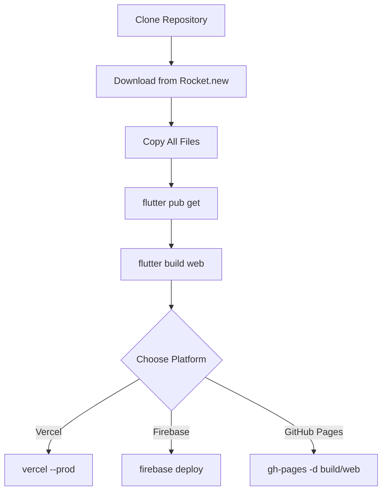

# ScrapKart-Flutter Deployment Guide

## Important Note About Flutter & Vercel

**This is a Flutter mobile application.** Flutter apps need to be built for web before deploying to platforms like Vercel.

### The Challenge
Vercel hosts static websites and serverless functions. Flutter mobile apps need to be compiled to web format first using:
```bash
flutter build web --release
```

## Complete Deployment Process

### Option 1: Deploy to Vercel (Requires Local Build)

#### Step 1: Complete Project Setup

1. **Clone and setup locally:**
```bash
git clone https://github.com/karanxrathod0000/ScrapKart-Flutter.git
cd ScrapKart-Flutter
```

2. **Copy remaining files from Rocket.new:**
   - Download code from Rocket.new
   - Copy all remaining widget files to `lib/presentation/home_dashboard/widgets/`
   - Copy env.json, pubspec.lock
   - Copy web/, android/, ios/ platform folders

3. **Install Flutter dependencies:**
```bash
flutter pub get
```

#### Step 2: Build for Web

```bash
# Build Flutter web app
flutter build web --release

# This creates: build/web/ directory with index.html and assets
```

#### Step 3: Deploy to Vercel

**Method A: Vercel CLI**
```bash
# Install Vercel CLI
npm install -g vercel

# Navigate to build output
cd build/web

# Deploy
vercel --prod
```

**Method B: Vercel GitHub Integration**
1. Go to [vercel.com](https://vercel.com)
2. Import GitHub repository
3. Set build command: `flutter build web --release`
4. Set output directory: `build/web`
5. Deploy

#### Step 4: Configure vercel.json (Already in Repo)

Create `vercel.json` in project root:
```json
{
  "buildCommand": "flutter build web --release",
  "outputDirectory": "build/web",
  "framework": null,
  "rewrites": [
    {
      "source": "/(.*)",
      "destination": "/index.html"
    }
  ]
}
```

### Option 2: Firebase Hosting (Recommended for Flutter)

Firebase Hosting is better optimized for Flutter web apps:

```bash
# Install Firebase CLI
npm install -g firebase-tools

# Login to Firebase
firebase login

# Initialize hosting
firebase init hosting
# Select: build/web as public directory
# Configure as single-page app: Yes
# Set up automatic builds: No (optional)

# Build and deploy
flutter build web --release
firebase deploy --only hosting
```

### Option 3: GitHub Pages (Free Alternative)

```bash
# Build for web
flutter build web --release

# Deploy using gh-pages
npm install -g gh-pages
gh-pages -d build/web
```

## Current Project Status

### ✅ Completed
- Core Flutter app structure
- Main application files
- All major presentation screens
- Theme and custom widgets
- README documentation

### ⏳ Remaining Tasks

1. **Copy remaining files from Rocket.new:**
   - 5 dashboard widget files
   - Configuration files (env.json, pubspec.lock)
   - Platform folders (web/, android/, ios/)
   - Assets folder

2. **Configuration:**
   - Add Firebase configuration
   - Add Google Maps API key
   - Configure Supabase credentials

3. **Build & Test:**
   - Run `flutter pub get`
   - Test locally: `flutter run -d chrome`
   - Build for web: `flutter build web`

4. **Deploy:**
   - Choose deployment platform
   - Deploy built app
   - Test deployed version

## Quick Deploy Commands

### Local Development
```bash
flutter run -d chrome          # Run in Chrome
flutter run -d edge            # Run in Edge
flutter run                    # Run on connected device/emulator
```

### Production Build
```bash
flutter build web --release    # Web
flutter build apk --release    # Android
flutter build ios --release    # iOS (requires Mac)
```

## Troubleshooting

### Issue: "Flutter not found"
**Solution:** Install Flutter SDK from [flutter.dev](https://flutter.dev)

### Issue: "pubspec.yaml not found"
**Solution:** Ensure you're in project root directory

### Issue: "Missing dependencies"
**Solution:** Run `flutter pub get`

### Issue: "Web build fails"
**Solution:** 
```bash
flutter clean
flutter pub get
flutter build web --release
```

### Issue: "Vercel deployment fails"
**Solution:**
1. Ensure Flutter is installed on build environment
2. Or: Build locally and deploy the `build/web` folder directly
3. Or: Use Firebase Hosting instead

## Alternative: Pre-built Deployment

Since building Flutter requires Flutter SDK, you can:

1. **Local build → Upload:**
   - Build locally: `flutter build web`
   - Upload `build/web` contents to any static host
   - Vercel, Netlify, Firebase, GitHub Pages all work

2. **Use Rocket.new's export:**
   - Download complete code from Rocket.new
   - It may include pre-built web files
   - Deploy those directly

## Recommended Deployment Flow



## Success Criteria

- ✅ App loads in browser
- ✅ All screens are accessible
- ✅ Navigation works
- ✅ No console errors
- ✅ Responsive on mobile and desktop

## Support

For deployment issues:
1. Check Flutter web documentation
2. Verify all files are copied
3. Test locally first before deploying
4. Check Vercel/Firebase logs for errors

---
**Next Step:** Complete file copying from Rocket.new, then follow deployment steps above.
